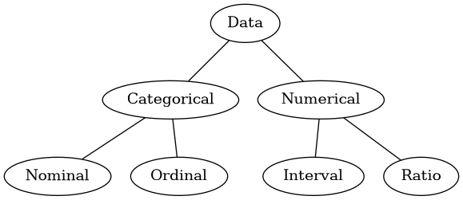

# Introduction

Throughout this course we'll be think a lot about what insights and conclusions
we can gain from organizing and analyzing data. In CS we talk about 'data' so
much that it's often easy to overlook some key points about the nature of data
and what we mean when we talk about 'data'.

# Type of data but not data-types

When think about data, whether or not we collect it ourselves, it can be useful
to think about the *kind* of data that we're using. Not all data can be treated
the same, and it would be dangerous to assume that the operations you can use
on some data are appropriate for all data.

Let's take temperature data as an initial example. What do we know about
temperature? There are many units that might be involved (F, C, K, etc.), it's
appropriate to say that two temperatures are 'equal', and furthermore they can
be equal even if they are not using the same units! No one would bat an eye if
you said that 32F is equal to 0C in your analysis. Temperature also has an
*order*, without getting into the Physics of what temperature *is*, it is fine
to say "70F is greater than 60F".

Now let's take street names as our data. In particular we'll take street names
from York, North Yorkshire.  We can still say that two street names are the
same: If two business list "Shambles" as their street, it's sensible to say
that they're on the same street. So streets also have a notion of *equal*.  But
what about *order*? Is it appropriate to say that Shambles is 'more' or
'greater' than Whip-Ma-Whop-Ma-Gate? Order may make sense for numbered streets
or in a town that uses a grid-layout for its streets, but York neither numbers
their streets nor has anything that one might consider 'organization' with
regard to its layout.

With these two examples we can see that some operations (ordered comparison, in
this case) is not appropriate for everything we might have in a dataset.

Have people thought about how to classify these differences? Yes. Are we going
to discuss them right now? Also yes.

## A statistician's view of data-types

If we squint, we can say that statistician's classify data into 4 categories
(note, this is a bit of a simplification but like many simplifications this
helps us think about the issue at hand and adapt when we need to):

 * Nominal
 * Ordinal
 * Interval
 * Ratio

We'll discuss each of these in turn, so don't worry if this doesn't immediate
make you say "of course, it makes perfect sense!".

Now, we can abstract these categories a little bit but noticing some of the
common aspects between them. This gives us the following view of the
categories:

### Nominal Data

Think "finite sets", where equality is well understood, but comparison between
elements is not necessarily sensical. Examples include:

 * The names of clothing brands
 * Flavors of soda
 * List of cities

### Ordinal Data

For something to be considered ordinal data, we must be able to provide an
ordering to the data, but the _distance_ or _measure_ of the ordering isn't
necessarily clear or well-founded. Example include:

 * Survey responses (e.g. Agree vs. Neutral vs. Disagree)
 * Weather reports (e.g. sunny vs. partly cloudy vs. overcast)

We can order these things, overcast is 'more cloudy' than sunny, but there
might not be a well established measure of where the exactly line between
categories is and how you measure that where you are on that scale.

### Interval Data

For interval data we are now fully in the realm of numerical data, we can order
things, subtract things from other things, take the average of things, etc.
However, we aren't able to reason about the _ratios_ of these values. Example include:

 * Temperature: we can say "today was 5 degrees warmer than yesterday" but we can't say "100C is twice as hot as 50C"
 * SAT scores
 * Credit scores

### Ratio Data

Ration Data has all the properties of interval data, but also a meaningful 0
and we can reason about the ration of two elements. Examples include:

 * Age (it makes sense to say that I'm twice as old as someone else)
 * Running speed
 * Things dealing with money
 * weight
 * length

# The things we can do

A taxonomy like the above is all well and good, but where this view becomes
_useful_ is in providing rough ideas about what sorts of
operations/manipulations may be appropriate for various forms of data.

Below we're going to list some common numeric operations that we often use when
analyzing data. For each of these operations, we'll show whether it's
meaningful (in general) to do that operation on each type of data.

## Frequency Distribution

  - [x] Nominal
  - [x] Ordinal
  - [x] Interval
  - [x] Ratio

## Median and Percentiles

  - [ ] Nominal
  - [x] Ordinal
  - [x] Interval
  - [x] Ratio

## Addition or Subtraction

  - [ ] Nominal
  - [ ] Ordinal
  - [x] Interval
  - [x] Ratio

## Mean or Standard Deviation

  - [ ] Nominal
  - [ ] Ordinal
  - [x] Interval
  - [x] Ratio

## Ratio or Coefficient of variation

  - [ ] Nominal
  - [ ] Ordinal
  - [ ] Interval
  - [x] Ratio

